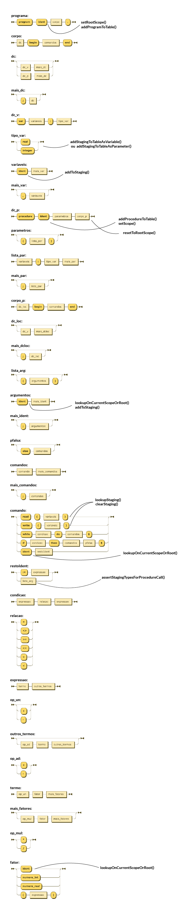

# Compiler

Compilador de exemplo em Kotlin com análise léxica, sintática e semântica para matéria de Compiladores.

## Executando

```
$ ./gradlew build
$ java -jar build/libs/compiler-1.0.jar example.txt
```


## Definição

```
Z ::= I S
I ::= 'var' D
D ::= L ':' K O
L ::= 'id' X
X ::= (',' L)?
K ::= 'integer' | 'real'
O ::= ( ';' D )?
S ::= ( 'id' ':=' E | 'if' E 'then' S )
E ::= T R
R ::= ( '+' T R )?
T ::= 'id'
```

Essa definição pode criar uma linguagem que interpreta o seguinte código:
```
var foo, bar: integer;
    foobar: real
if foo + bar then foo := bar
```
## Grafos sintáticos
